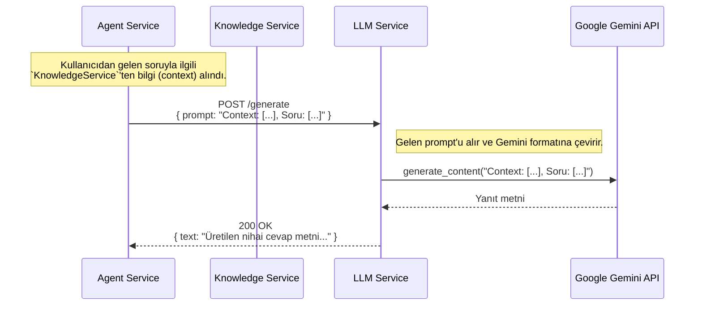

# 🧠 Sentiric LLM Service - Mantık ve Akış Mimarisi

**Belge Amacı:** Bu doküman, `llm-service`'in Sentiric platformunun **"soyutlanmış beyni"** olarak rolünü ve diğer servislerle olan basit ama kritik etkileşimini açıklar.

---

## 1. Stratejik Rol: "Evrensel Dil Tercümanı"

Bu servisin tek ve net bir görevi vardır: Kendisine verilen herhangi bir `prompt`'u, arkada çalışan LLM sağlayıcısının (Gemini, OpenAI vb.) anlayacağı formata çevirmek, yanıtı almak ve bu yanıtı standart bir metin olarak geri döndürmek.

**Bu servis sayesinde platform:**
1.  **Bağımsız Olur:** Ana orkestratör (`agent-service`), Google'ın veya OpenAI'ın SDK'larını, API anahtarlarını veya veri formatlarını bilmek zorunda değildir. Bu karmaşıklık tamamen `llm-service` içinde saklanır.
2.  **Esnek Olur:** Platformun kullandığı "beyni" değiştirmek, sadece bu servisin içindeki bir adaptörü veya `.env` dosyasını değiştirmek kadar kolaydır. `agent-service`'te tek satır kod değiştirmeye gerek kalmaz.
3.  **İzole Edilir:** LLM'lerin gerektirdiği ağır Python bağımlılıkları (`google-generativeai`, `tensorflow` vb.) platformun geri kalanından izole edilerek potansiyel çakışmalar önlenir.

---

## 2. Temel Çalışma Prensibi: Basit Bir Ağ Geçidi (Gateway)

`llm-service`, kendisine gelen HTTP isteklerini işleyen basit bir ağ geçididir. Gelen isteğin içindeki `prompt` metnini alır ve bunu doğrudan, yapılandırılmış olan LLM sağlayıcısına gönderir.

**ÖNEMLİ NOT:** `llm-service`'in kendisi RAG (Retrieval-Augmented Generation) yapmaz. RAG için gerekli olan "bilgi arama" ve "prompt zenginleştirme" işlemleri, bu servisi çağıran **`agent-service`'in sorumluluğundadır.** `llm-service` sadece kendisine verilen nihai prompt'u işler.

---

## 3. Uçtan Uca İstek Akışı

Bir RAG sorgusu sırasında `llm-service`'in rolü aşağıdaki gibidir:

